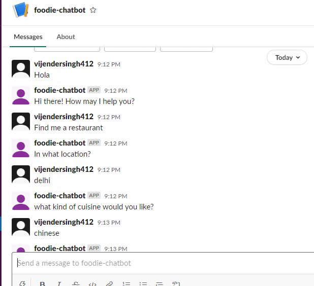
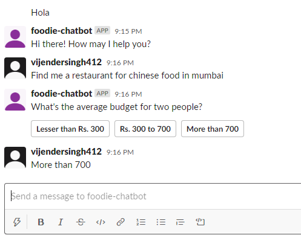
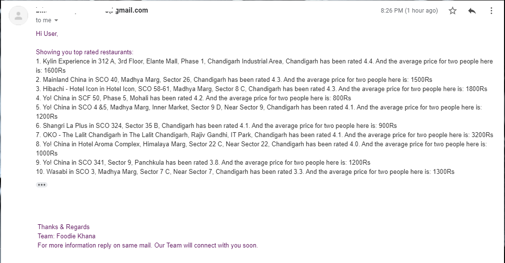

# Foddie_Khana_rasa_2.0

This repo contains a chatbot for Food ordering and using Zomato Api for searching best restaurant.
An Indian startup named 'Foodie Khana' wants to build a conversational bot (chatbot) which can help users discover restaurants across several Indian cities.
The main purpose of the bot is to help users discover restaurants quickly and efficiently and to provide a good restaurant discovery experience.
Currently the compant is having its business in Tier-1 and Tier-2 cities. 

 	
| HRA classification        | City           |
| ------------------------- |:--------------:|
| Tier-1                         | Ahmedabad, Bengaluru, Chennai, Delhi, Hyderabad, Kolkata, Mumbai and Pune |
| Tier-2                         | Agra, Ajmer, Aligarh, Amravati, Amritsar, Asansol, Aurangabad, Bareilly, Belgaum, Bhavnagar, Bhiwandi, Bhopal, Bhubaneswar, Bikaner, Bilaspur, Bokaro Steel City, Chandigarh, Coimbatore, Cuttack, Dehradun, Dhanbad, Bhilai, Durgapur, Dindigul, Erode, Faridabad, Firozabad, Ghaziabad, Gorakhpur, Gulbarga, Guntur, Gwalior, Gurgaon, Guwahati, Hamirpur, Hubli–Dharwad, Indore, Jabalpur, Jaipur, Jalandhar, Jammu, Jamnagar, Jamshedpur, Jhansi, Jodhpur, Kakinada, Kannur, Kanpur, Karnal, Kochi, Kolhapur, Kollam, Kozhikode, Kurnool, Ludhiana, Lucknow, Madurai, Malappuram, Mathura, Mangalore, Meerut, Moradabad, Mysore, Nagpur, Nanded, Nashik, Nellore, Noida, Patna, Pondicherry, Purulia, Prayagraj, Raipur, Rajkot, Rajahmundry, Ranchi, Rourkela, Salem, Sangli, Shimla, Siliguri, Solapur, Srinagar, Surat, Thanjavur, Thiruvananthapuram, Thrissur, Tiruchirappalli, Tirunelveli, Ujjain, Bijapur, Vadodara, Varanasi, Vasai-Virar City, Vijayawada, Visakhapatnam, Vellore and Warangal: |


It will reply back with something like "We do not operate in that area yet" if your city is not amoung Tier-1 and Tier-2.

The bot is able to identify common synonyms of city names, such as Bangalore/Bengaluru, Mumbai/Bombay, Allahabad/Prayagraj etc.
The cuisine preference is taken from the customer.



The bot will then ask for Average budget for two people.


 
And then it returns the results to the user, displaying the top 5 restaurants in a sorted order (descending) of the average Zomato user rating (on a scale of 1-5, 5 being the highest). 

>The format is as: {restaurant_name} in {restaurant_address} has been rated {rating}.

Finally, the bot will ask the user whether he/she wants the details of the top 10 restaurants on email. If the user replies 'yes', the bot should ask for user’s email id and then send it over email. Else, just reply with a 'goodbye' message. 

```The mail will have the following details for each restaurant:
Restaurant Name
Restaurant locality address
Average budget for two people
Zomato user rating 
```



### Steps to get start: Lets Go: YEEEEEEEEEEEEEEE
1. Install Python and Rasa. Find the below version useful.

```Python: 3.8.3
Tensorflow: 2.3.1
Rasa Version     : 2.0.2
Rasa SDK Version : 2.0.0
Rasa X Version   : None
Python Version   : 3.8.3
Operating System : Windows-10-10.0.18362-SP0
Python Path      : c:\programdata\miniconda3\python.exe
```
2. Clone the repo:
3. Its recommended to create a virtual enviornment before start working.
4. You dont require any dependencies to install. Requirements.txt file has already been shared as zomatopy.py in same repo.
5. Actions Require a Zomato API creditials. Grab it from [here](https://developers.zomato.com/api) Once you get key you can paste it to actions.py file under user key. *Basic:* Get free and instant access to restaurant information and search APIs (up to 1000 calls/day) Free tier.
6. Mailing: Mailing requires a gmail or account to send and receive mails. Please create temporary mail and paste it into actions
7. Slack Integration:  Follow this [link](https://medium.com/analytics-vidhya/integrating-your-rasa-chat-bot-with-slack-c18bffc6018b). If error create a issue. 

## Thanks for reading. Let me know in case of issue.. 
